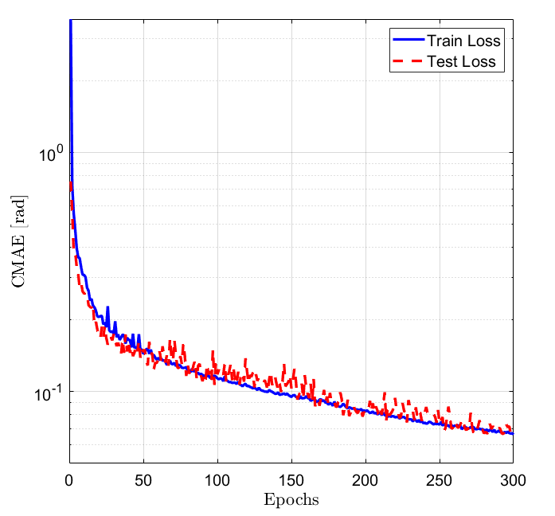
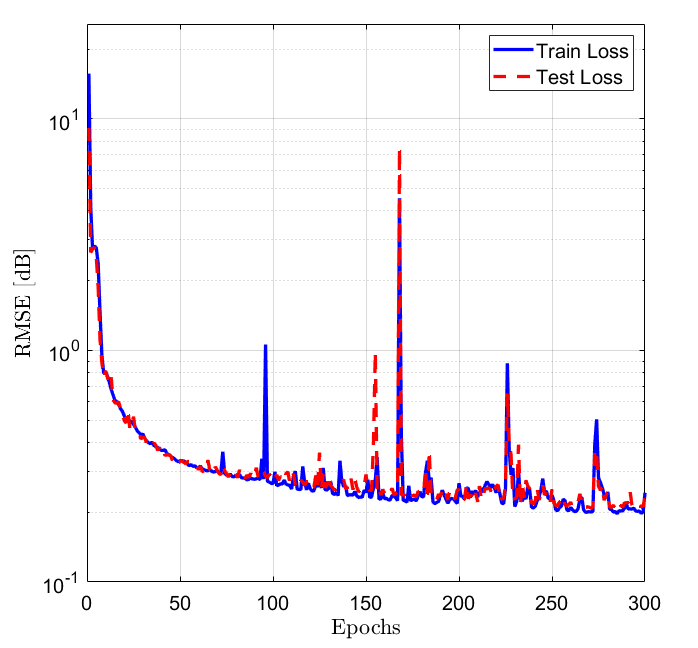
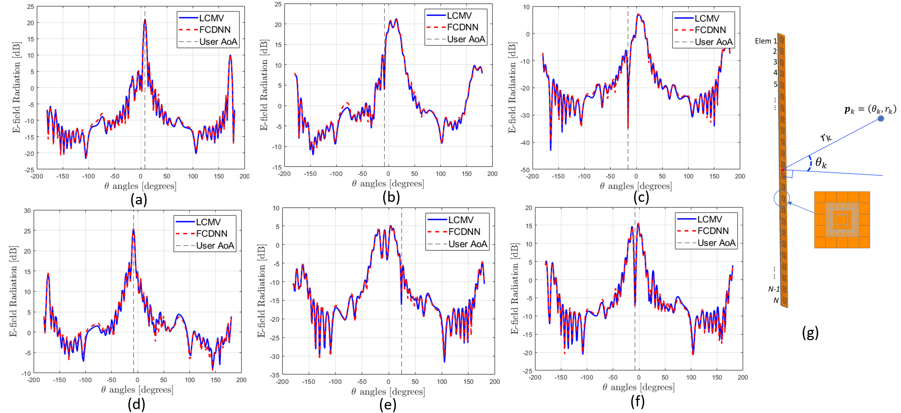

# DNN-Based Nulling Control Beam Focusing for Near-Field Multi-User Interference Mitigation

This repository accompanies the paper:

> **DNN-Based Nulling Control Beam Focusing for Near-Field Multi-User Interference Mitigation**  
> Mohammadhossein Karimi, Yuanzhe Gong, Tho Le-Ngoc  
> Department of Electrical and Computer Engineering, McGill University  
---

## Project Overview
Near-field beamforming with **extra-large MIMO (XL-MIMO)** enables **location-differentiated beam focusing** for high-capacity wireless networks.  
The main challenge: mitigating **multi-user interference (MUI)** using **Nulling Control Beam Focusing (NCBF)**.  

We propose a **dual-estimator Deep Neural Network (DNN)**:  
- One estimator for **magnitude** prediction.  
- One estimator for **phase** prediction.  

The model is trained on data generated by the **Linearly Constrained Minimum Variance (LCMV)** beamformer and achieves **real-time NCBF prediction** with high accuracy.  


---

## Model Architecture
The proposed **dual-estimator architecture** is shown below:

<p align="center">
  
</p>

- Two independent **Fully Connected DNNs (FCDNNs)**.  
- Inputs: desired & interfering user coordinates.  
- Outputs: NCBF weights (magnitude & phase).  

---

## Installation

### 1. Clone the repository
```bash
git clone https://github.com/mhosseinkarimi/DNN_NF_NCB.git
cd DNN_NF_NCB
```

### 2. Create a Python environment (recommended)
Using `conda`:
```bash
conda create -n ncbf-dnn python=3.9
conda activate ncbf-dnn
```

Or using `venv`:
```bash
python3 -m venv ncbf-dnn
source ncbf-dnn/bin/activate   # Linux/Mac
ncbf-dnn\Scripts\activate      # Windows
```

### 3. Install dependencies
```bash
pip install -r requirements.txt
```
---

## Usage

### Train Models
Run the training scripts for **phase** and **magnitude** estimators:
```bash
python ./train.py
```

### Evaluate Models
Evaluate the trained models on the test set:
```bash
python ./test_cases.py
```
---

## 📊 Results

### 🔹 Hyperparameter Tuning
**Table I. Validation Loss (RMSE) for Magnitude Estimator**
| Index | Model Structure | Validation RMSE [dB] |
|-------|-----------------|-----------------------|
| A1 | [6, 512, 1024, 1024, 1024, 1024, 512, 24] | 0.569 |
| A2 | [6, 512, 1024, 1024, 1024, 512, 24]       | 0.565 |
| A3 | [6, 1024, 1024, 1024, 1024, 1024, 24]     | 0.559 |
| **A4** | **[6, 1024, 1024, 1024, 1024, 1024, 1024, 24]** | **0.533** |

**Table II. Validation Loss (CMAE) for Phase Estimator**
| Index | Model Structure | Validation CMAE [rad] |
|-------|-----------------|------------------------|
| P1 | [6, 1024, 1024, 1024, 1024, 24]           | 0.146 |
| P2 | [6, 512, 1024, 1024, 1024, 512, 24]       | 0.146 |
| P3 | [6, 512, 1024, 1024, 1024, 1024, 512, 24] | 0.145 |
| **P4** | **[6, 1024, 1024, 1024, 1024, 1024, 1024, 24]** | **0.142** |

---

### 🔹 Training & Test Losses

**Phase Estimator Loss (CMAE):**
<p align="center">
  
</p>

**Magnitude Estimator Loss (RMSE):**
<p align="center">
  
</p>

**Table III. Final Losses**
| Estimator          | Training Loss | Test Loss |
|--------------------|---------------|-----------|
| Phase Estimator    | 0.066 rad     | 0.067 rad |
| Magnitude Estimator| 0.202 dB      | 0.206 dB |

---

### 🔹 Beam Pattern Validation

**Full-wave HFSS simulations** validate the predicted NCBF vectors against the LCMV reference.  
Beam patterns from **DNN-predicted weights** closely match those of the LCMV approach, ensuring effective interference suppression.

<p align="center">
  
</p>

- Average **MUI suppression**: **36.7 dB**  
- Minimum suppression across all cases: **17.5 dB**  
- Angular deviation in null placement: **< 0.5°**  

---

## 📌 Citation
If you use this repository, please cite our paper:

```
@article{Karimi2025NCBF,
  author    = {Mohammadhossein Karimi and Yuanzhe Gong and Tho Le-Ngoc},
  title     = {DNN-Based Nulling Control Beam Focusing for Near-Field Multi-User Interference Mitigation},
  year      = {2025}
}
```
---

## 📝 License
This project is licensed under the MIT License.  
See [LICENSE](LICENSE) for details.

---
